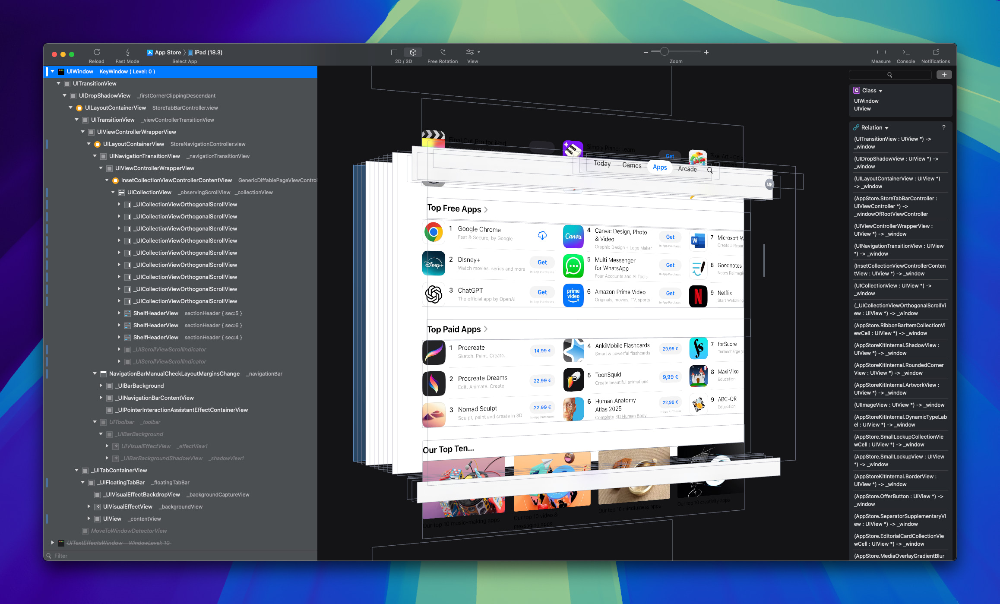
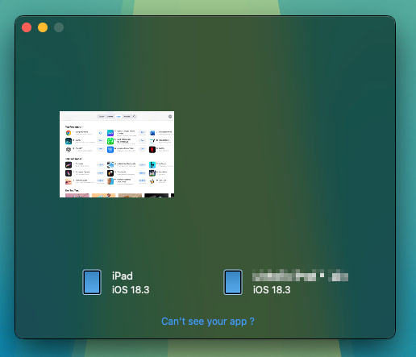

# LookinLoader

LookinLoader is a jailbreak tweak that allows you to load the `LookinServer` binary into iOS applications for UI inspection and debugging purposes using the [Lookin](https://lookin.work/) app on macOS. This tweak is particularly useful for developers who want to analyze the view hierarchy of iOS apps in real-time.



## Prerequisites
* A [jailbroken iOS device](https://ios.cfw.guide/) (compatible with rootless jailbreaks; confirmed to work on iOS 16 and iOS 18).
* [Theos](https://theos.dev/docs/installation) installed and up-to-date on your Mac.
* [Lookin](https://lookin.work/) app installed on your Mac.

## Installation

### 1. Clone this Repository

```console
$ git clone https://github.com/imkh/LookinLoader.git
$ cd LookinLoader
```

### 2. Pseudo-sign the LookinServer binary

The `LookinServer` binary provided in this repository comes from the [Source repo.zip](https://github.com/DargonLee/LookinRootless/archive/refs/tags/release-v0.1.0.zip) of the [DargonLee/LookinRootless](https://github.com/DargonLee/LookinRootless/releases/tag/release-v0.1.0)'s 0.1.0 release. This is the only version of a `LookinServer` binary with an `arm64e` slice, required to run on A12+ devices, I could find. Ideally, build instructions to compile a new `LookinServer` binary from [source](https://github.com/QMUI/LookinServer) should be added here, but I have not yet found the exact steps to do so with only the `Package.swift` file present in the [LookinServer](https://github.com/QMUI/LookinServer) repository.

```console
$ ldid -S layout/Library/Application\ Support/LookinLoader/LookinServer
```

or

```console
$ codesign -f -s - layout/Library/Application\ Support/LookinLoader/LookinServer
```

Upon installation of the tweak, the contents of `layout/` will be mapped to `/var/jb/` on your iOS device. This means the binary will be placed at:

```
/var/jb/Library/Application Support/LookinLoader/LookinServer
```

### 3. Build the tweak with Theos

```console
$ make package
```

This will produce a `.deb` package inside a new `packages/` directory.

### 4. Install LookinLoader on your device

Transfer the resulting `.deb` package to your jailbroken iOS device using SSH and install it.

```
$ scp packages/io.imkh.lookinloader_1.0-1+debug_iphoneos-arm64.deb mobile@<device_ip>:/var/jb/var/mobile
$ ssh mobile@<device_ip>
$ sudo dpkg -i io.imkh.lookinloader_1.0-1+debug_iphoneos-arm64.deb
```

Verify that the tweak was installed:

```console
$ sudo dpkg -l | grep "io.imkh.lookinloader"
ii  io.imkh.lookinloader                                  1.0-1+debug               iphoneos-arm64 Lookin Loader, unofficial
```

Verify that the `LookinServer` binary is in place:

```console
$ ls "/var/jb/Library/Application Support/LookinLoader/LookinServer"
```

Respring your device:

```console
$ killall SpringBoard
```

After respringing, your iOS device and any app you open should appear in Lookin, ready to inspect:



## Troubleshooting

### Uninstalling the tweak

To uninstall LookinLoader:

```console
$ sudo dpkg -r io.imkh.lookinloader
```

Then respring your device:

```console
$ killall SpringBoard
```

### Checking error logs

If Lookin does not detect your device or app, check for error messages in the system logs. LookinLoader includes basic error handling that logs a message if loading `LookinServer` fails.

1. Open `Console.app` on your Mac.
2. Select your iOS device in the sidebar.
3. Click `Start Streaming`.
4. Open the app you want to inspect on your iOS device.
5. Filter for messages containing: `[LookinLoader]`.

### General checks

* Ensure the `LookinServer` binary is placed at the exact path specified in `LookinLoader.xm`, with executable permissions.
* Restart the target app after placing the binary.
* Respring your device if issues persist.
